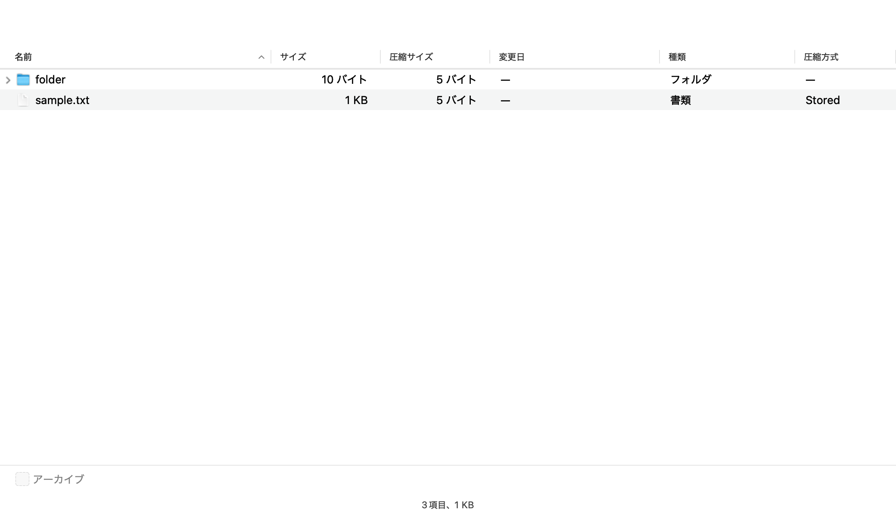
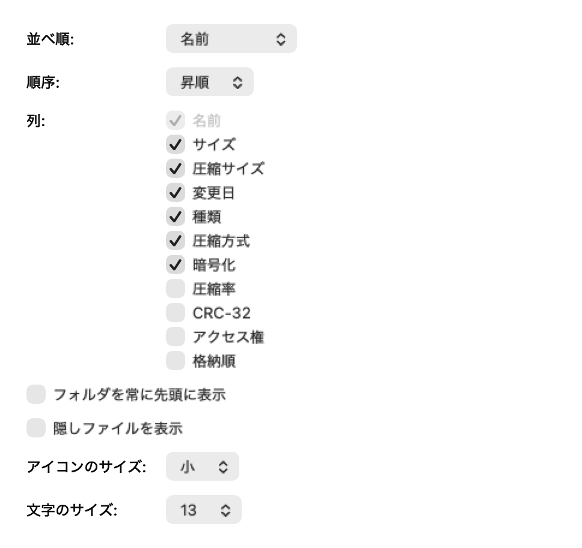
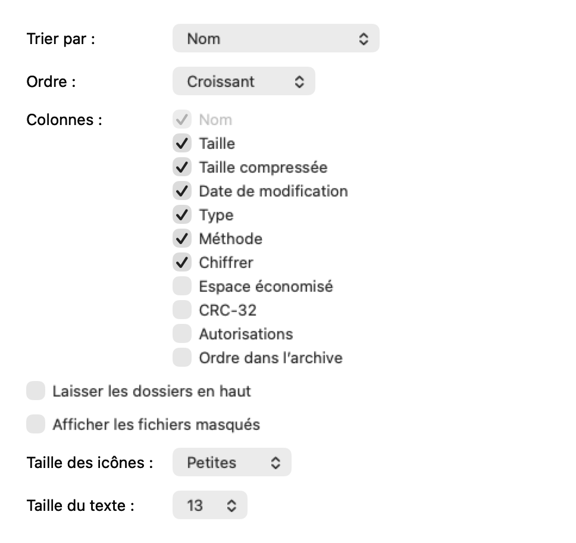
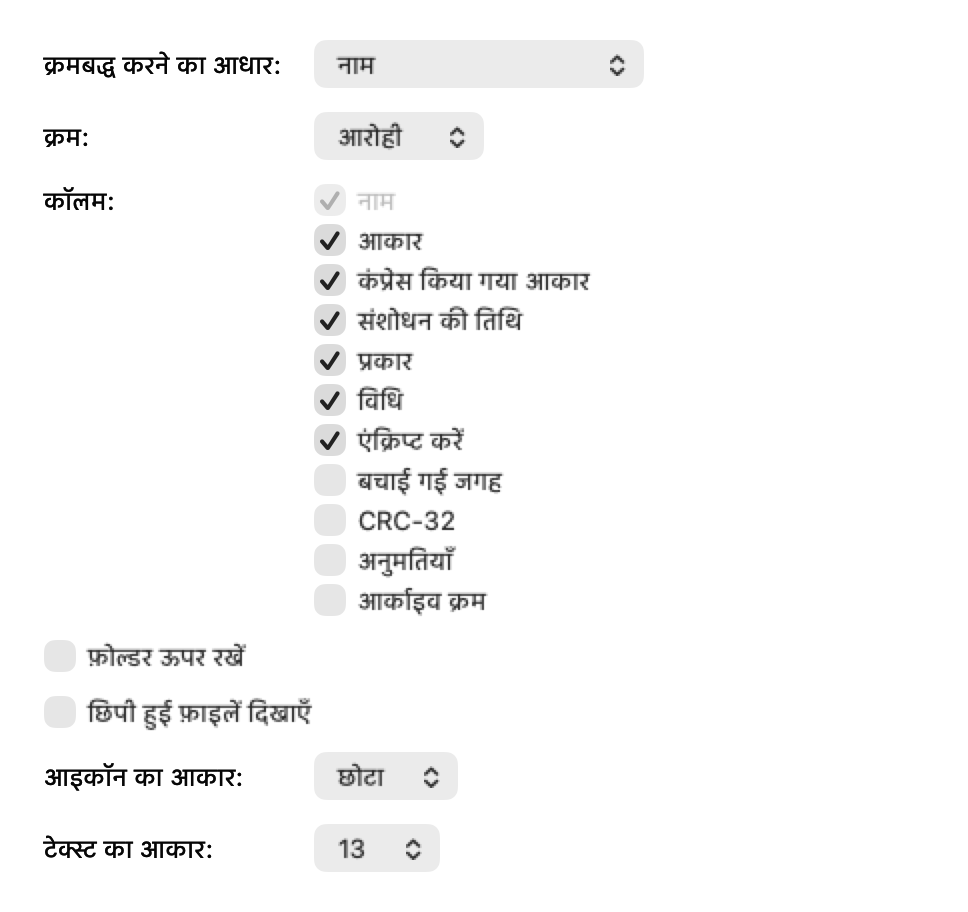

# S35 / P10-a・S36 / P10-b: フォルダへの移動と表示オプション

2026-09-26。S35 はオーケストレータが検証し、`4d4be0b` にコミットした。
以下に S35 初回・[correction 1](#s35-correction-1)・オーケストレータの検証を残し、
末尾に [S36 / P10-b](#s36--p10-b-表示オプション) を追記した。**S36 は未コミット**。
各段の通常host・実入力の実施状況は、それぞれの節を参照。

仕様: [P8-P9-P10 の P10-a](../pending/specs-2026-09-26/P8-P9-P10.md)、
[ORDER-P6-P13 §2](../pending/specs-2026-09-26/ORDER-P6-P13.md)。
利用者の2026-09-26の承認どおり、フォルダを開く既定は `.enter`。
行番号ではなく型・関数名で確認し、仕様が参照する既存の型・関数に欠落はなかった。

## 出自とビルドの隔離

canonical の `feature/2026-09-24-review`、clean な `b450765f78c15e4a7d69058b0b856e4ab221f34c` から着手。
`git archive --format=tar <commit>` で次の三つを
`build/P10S35Verification/layout/{KaitoFinder,GyoshukuKit,KaitoKit}` に展開した。
以後、KaitoFinder の製品・試験・Tools だけを canonical の内容で更新した。

| 対象 | 固定 commit |
|---|---|
| KaitoFinder の基底 | `b450765f78c15e4a7d69058b0b856e4ab221f34c` |
| GyoshukuKit | `52655cbd76f73f97f4715d06baed1478d6b30a47` |
| KaitoKit | `823ad460faab055b6b7051da10583480785e8f68` |

[source-checks.json](../../build/P10S35Verification/source-checks.json) で、固定archiveの全ファイル
（KK1,513 / GK295）が隔離先と一致し、最終KFの製品137 / 試験172 / Tools21ファイルもcanonicalと一致することを確認。
live sibling と `GyoshukuKit-p14` はビルド・変更していない。
兄弟リポジトリへ行った操作は固定 commit の `git archive` のみ。
[archive-checks.json](../../build/P10S35Verification/archive-checks.json)、
[compiled-sources.json](../../build/P10S35Verification/compiled-sources.json) に出自とコンパイル入力を記録。

## 実装と AC

- **a1**: window ごとの現在位置、各100件の戻る・進む、32件の表示状態のLRU。
  戻る・進むでは選択・展開・スクロールを復元し、新しい移動では復元しない。
  内包フォルダへは出てきた子を選択する。パスバーの現在位置では履歴を増やさない。
  複数フォルダの「開く」はその場で展開する。`.expand` は従来の動作。
- **a2**: 検索は書庫全体を表示し、消すと現在のフォルダと検索前の選択へ戻る。
  結果からの移動は検索を同期で消し、未完了の非同期検索も取り消す。
  `displayedRoot` の代入は init・navigate・reloadFilteredEntries の3か所。
  表示の差し替えでは旧表示を collapse してから代入する。P8 の requested/applied の区別を維持。
- **a3**: 再読込では現在位置をパスで解決し直し、消失・非表示なら最も近い祖先へ戻る。
  改名・移動の公開成功後は現在位置と履歴・保存状態のパスを書き換える。undo/redo では追従しない。
  表示の根自身と外側の node を expand/collapse/選択/scroll の対象にしない。
- **a4**: ペースト・追加・空白の新規フォルダ・ドロップは表示中の場所へ。
  追加パネルは開いたときのパスを保持し、消えた追加先で処理を始めない。
  すべて展開・無選択の展開は従来どおり書庫全体。
- **a5–a6**: 「移動」メニュー、⌘[・⌘]・⌘↑、戻る/進むのツールバー、設定のpopup。
  NSText が first responder の間は3メニューを無効にし、ツールバーの判定は独立。
  設定を `.expand` に変えると全ウインドウが最上位へ戻り、履歴を消去。
  `ArchiveFolderOpening` を TestProcessSetup と AutosaveIsolationTests に追加。
- **a7**: `testNavigationScaleWhenEnabled` を追加。500,000件・5,000フォルダの木で enter/back/enclosing をそれぞれ測り、50 ms以下を検査。
  最適化した受入計測は今回未実行。
- **a8 / AC-W**: Localizable の7キーと新しい GoMenu table の1キーに、26言語の translated 値。
  既存の `移動`（Move）を含め、既存の訳は変更していない。French colon の改行しない空白も検査。
- **a9**: 関連する試験を追加・更新。通常 host の全件は未実行。

### AppKit のコンストラクタについて

仕様の `NSToolbarItemGroup(itemIdentifier:images:selectionMode:labels:target:action:)` を
サブクラス名で呼んでも、このSDK/ランタイムでは基底の `NSToolbarItemGroup` が返り、
サブクラスの `validate()` が使われなかった（初回試験で確認）。
そのため `ArchiveNavigationToolbarItemGroup` は指定初期化子と `.momentary` の
`NSSegmentedControl` を使う。二つの subitem の有効状態と実際の segment の有効状態を同期し、
メニューの NSText 規則を通さない。画像の accessibility description と各segmentのtooltipも各操作名。
実クリック・アクセシビリティの最終確認は通常hostで行う。

### 既存の試験を変えた理由

- ArchiveFinderInteractionTests の従来のダブルクリック・⌘矢印の assert はそのまま。
  その2試験だけ `.expand` を注入し、`.enter` の実入力試験を別に追加。
- ArchiveDisplayTests の既定ツールバー一覧の先頭に `navigation` を追加。
- WordingAcceptanceTests のメニュー一覧に GoMenu の題を追加し、3項目・キー・responder chainを検査。
- LayoutOverflowTests の一般タブの popup 一覧に folderOpeningPopup を追加。
- FileURLDragInfo は空のURL配列ならpasteboardへ書かない。新しいlocal move試験はURLを使わないため。
  非空配列の既存の書き込み assert は残した。
- 設定の既定値と不正値、autosave の一覧に新しい設定を追加。

## 実行した検証

実行環境は **macOS 27.2 (26B5091g)、Apple Swift 6.4**。
Swift 6言語モード、製品はdefault isolation = MainActorと既存のupcoming featureを維持。
最終ビルドは兄弟・製品・試験とも `-target arm64-apple-macos26.0` を明示。
実行自体はmacOS 27.2上なので、macOS 26実機での確認ではない。
初期のビルド・試験はhost既定の27.2 targetだったため、26 targetで作り直して関連試験を実行した。
初期の保存済みcommand/logは [pre-target26](../../build/P10S35Verification/pre-target26/)。
実際のSparkle frameworkを使用。依存Swift moduleは固定archiveから新規に作ったもののみ。

### ビルド

`build/P10S35Verification/build.py` を使用した直接 `swiftc` コンパイル・リンク。
KK207 / GK62 / 製品104 / 試験150 Swift files。`xcodebuild` と `swift test` は今回起動していない。

- `--prepare KaitoKit GyoshukuKit`: 成功。
- `--sync app`: 成功。
- `--sync test`: 成功。
- `--sync app test`: 初期修正の3回とも成功。
- `--sync KaitoKit GyoshukuKit app test`: macOS26 targetでの作り直し、成功。
- `--sync app test`: 最後のtoolbar delegate判定とtest-host guardを反映、成功。
- `--sync test`: pasteboardを使わないlocal move試験を追加した最終試験ビルド、成功。

非DEBUG構成（`-DDEBUG` を除いた `swiftc -typecheck`）もexit0。
最終コンパイル入力のSHA-256とcanonicalの製品・試験が一致し、`git diff --check`も成功。
最終製品にcompiler診断はなく、試験のwarningは既存のArchiveDocumentControllerTests・ArchiveEditTests・ArchiveImportSafetyTestsのみ。
詳細は [app-command.json](../../build/P10S35Verification/app-command.json)・
[test-command.json](../../build/P10S35Verification/test-command.json)・各 `*-build.log`。

### XCTest

直接 `xctest -XCTest KaitoFinderTests.<selector> <bundle>` で実行。
通常のXcode application test hostの代わりにはならない。
[全93起動の一覧](data/2026-09-26/p10-navigation-test-runs.tsv) と
[command・環境・case・logの記録](../../build/P10S35Verification/test-results.json) に途中の失敗・反復・skipを含めた。
二つの短い起動が並行した際の集計上書きを、生ログから復元した（`recovered_from_log`）。
最終対象は [final-selection.json](../../build/P10S35Verification/final-selection.json)。

macOS26 targetの50起動と最後のlocal move単独1起動は **88成功・22skip・assertion失敗0、1起動が終了コード69で中断**。
中断は既存の `ArchivePreferencesUITests.testSavePanelAndSettingsShareDefaultFormat`。
システムの保存パネル作成時に `ClientCallsAuxiliary` / `HostCallsAuxiliary` のXPC接続が
`Connection invalid` となり、case完了の行に到達しなかった。
同じselectorの基底比較は今回行っていない。通常hostでの再確認が必要。

| 最終対象 | 結果 |
|---|---|
| ArchiveFolderNavigationTests | 17成功・3skip（pasteboard、failure sheet、opt-in規模計測） |
| ArchiveFinderInteractionTests | 2成功・13skip（native input runnerなし） |
| AsyncSearchFilterTests | 18成功・3skip（通常hostのシート・password・Quick Look） |
| M6bSearchTests | 1成功 |
| ArchivePreferencesTests / AutosaveIsolationTests | 7 / 2成功 |
| ArchiveDisplayTests（bundle言語照合以外の17 selector） | 17成功 |
| ArchivePreferencesUITests（9 selector） | 8成功、保存パネルの1起動がexit69 |
| ArchiveEntryControlsTests（14 selector） | 13成功・1skip（既存のLaunchServices public.folder判定） |
| DeferredSaveUITests（pending選択・undoによる木の縮小） | 2成功 |
| 新規blank file drop / menu integration | 各1skip（pasteboard service / compiled nibなし） |
| 最後に追加したblank local move（pasteboard fileなし） | 1成功。現在のフォルダへの同一位置の提案・受入をともに拒否し、原本は不変 |

初回の移動クラスは11成功・5失敗・2skip。toolbar factoryが基底型を返す問題、
空のpasteboard書き込み、抽出対象の並び順を表示順と比較した試験、既存出力先へのwriter新規作成、
pasteboard service不足を切り分けた。
第2回は14成功・2失敗・3skip（toolbarのtarget/選択の橋渡しと、置換fixtureのファイル名再利用）。
その後のtoolbar単独1回も選択の橋渡しで失敗し、修正後の3 selectorは全て成功。
最終版の移動クラスは上表のとおり。
製品の問題はtoolbarの構築とactionの接続を修正し、fixtureは新しいZIPを別名で作ってatomicに置換する形に直した。
抽出対象は実際の `root.children` の順序・identityで比較する。
既存のassertを環境に合わせて弱めていない。

新規のpasteboard利用試験は、pasteboard serviceへ書けない場合にskip。
追加パネルの失敗alertとメニュー連携の試験はアプリのtest host/compiled nibが無い場合にskip。
既存のnative input試験は専用runnerが無いとskipし、今回も実キー入力は送っていない。

### 文言

`xcstringstool compile` は最初に2ファイルを一度に渡してusage error（exit64）。
1ファイルずつに直して2回とも成功。
コンパイルした52個の `.strings`（2 table×26言語）を調べ、追加した208値がcatalogと一致。
さらに `check-resources.swift` から各 `.lproj` を `Bundle` として開き、tableを指定した208値のlookupも一致。
[検査結果](../../build/P10S35Verification/resource-checks.json)。

WordingAcceptanceTests のcatalog全体・26言語style・ellipsisの計28 selectorが成功。
新しい2試験のbuilt app bundle照合と、26言語でのメニュー・layoutの試験は通常hostでの実行待ち。

### 今回実行していないもの

通常hostの全件、`Tools/verify_finder_interactions.py`、`Tools/verify_ui_integration.py`、
実キー入力、500kの最適化したAC-a7計測、HFS+ / FAT32 / exFAT のvolume試験。
既存の `ScenarioDiskTests` と `Support/VolumePublishFixture.swift` は
hdiutilの起動失敗と非0終了をXCTSkipにすることを確認し、変更していない。

## GoMenu の26言語

このMacの `/System/Library/CoreServices/Finder.app/Contents/Resources/<language>.lproj/LocalizableMerged.strings` の
`FR24`（英語 Go）で値を確認した。言語フォルダ名は pt_BR / pt_PT / zh_CN / zh_TW / no を対応付けた。

| language | GoMenu「移動」 |
|---|---|
| ja | 移動 |
| en | Go |
| de | Öffnen |
| fr | Aller |
| es | Ir |
| it | Vai |
| pt-BR | Ir |
| zh-Hans | 前往 |
| zh-Hant | 前往 |
| ko | 이동 |
| th | ไป |
| vi | Đi |
| id | Buka |
| ms | Pergi |
| hi | जाएँ |
| ru | Перейти |
| nl | Ga |
| pl | Idź |
| tr | Git |
| sv | Gå |
| da | Gå |
| nb | Gå |
| fi | Siirry |
| uk | Перейти |
| cs | Otevřít |
| pt-PT | Ir |

## オーケストレータへの引継ぎ

固定した兄弟を使うには、隔離した
`build/P10S35Verification/layout/KaitoFinder/KaitoFinder.xcodeproj` をbuild/testする。
実入力runnerも **隔離した `layout/KaitoFinder/Tools/verify_finder_interactions.py --focused`** を使う。
canonicalのToolsから実行するとlive siblingを参照するため、この検証には使わない。
画面ロックがなくMacが空いている状態でAC-a5とUIを検証する。

AC-a7はP8と同じ `-O` / wholemoduleのDebug buildを使い、
`TEST_RUNNER_KAITOFINDER_PERFORMANCE_PROBES=1`、`TEST_RUNNER_KAITOFINDER_PROBE_ENTRIES=500000` で
`ArchiveFolderNavigationTests/testNavigationScaleWhenEnabled` を1回実行し、3本の `PROBE-NAVIGATION` 行を記録する。
S35の検証とcommit後、同じthreadでS36を開始する。今回はS36へ進まない。

## S35 correction 1

2026-09-26。オーケストレータから、固定 GK `52655cb` / KK `823ad46` の通常 Xcode test host で
build-for-testing 成功、全1,625件で既知のGUI環境依存失敗に加えて新規の決定的失敗2件、との報告を受けた。
`ApplicationCommandIntegrationTests` と `LayoutOverflowTests/testLockedPlaceholderInEveryLanguage` を
画面ロック解除後に絞っても再現し、前者の他10件は成功した、という報告に対する修正。
この通常hostでの実行はオーケストレータによるもので、以下のCodexの実行数には含めない。

### 修正内容と切り分け

- **navigation group 本体の無効化（製品の修正）**:
  `ArchiveNavigationToolbarItemGroup.validate()` が、戻る・進むの判定から
  group 自身と control 全体の `isEnabled` も設定する。
  その後に個別の subitem / segment を設定し、一方だけ使える状態も保つ。
  履歴なし・sessionなし・ロック中には group、control、両 subitem、両 segment が全て無効になる。
- **Open（試験の準備の修正）**:
  `validateMenuItem(openEntry:)` は `selectionOpenRefusal(skippingDirectories: true)` を使い、
  単一フォルダを許可していた。製品の Open 判定と `openEntry(_:)` は変更していない。
  `testOpenMenuValidationAllowsASingleFolderInEnterMode` を追加し、無選択では無効、フォルダ選択で有効、
  実行で `a` へ移動することを確認した。
  失敗した integration 試験は `NSApp` の nil-target dispatch に依存する一方、
  アプリのアクティブ化を待たず、新しく作ったメニューも main menu に設置していなかった。
  同クラスの既存toolbar/responder試験は `window.firstResponder.tryToPerform` を使うため、
  非アクティブなhostでも動作し、この前提を保証しない。
  `ArchivePreviewSidebarTests` / `ArchiveColumnsTests` のメニュー試験と同じく delegate を保持して
  `NSApp.mainMenu` に設置し、自動タブ化を止め、activate / key / main の成立を待ってから
  outline を first responder にする形へ修正した。
  選択が `a`、controller の validation が true、nil-target の実際の送り先が当該controllerであることも
  `menu.update()` / `performMenuItem` の前に検査する。通常hostでの修正後の成功確認は未実施。
- **実際の segment とラベル表示（製品と試験の修正）**:
  `NSSegmentedControl` 自身に controller / `navigateFromToolbar(_:)` を接続し、
  指定初期化子で作った group がサポートしない `selectionMode` の設定を削除した。
  control の `.momentary` は維持する。
  `testToolbarControlAndTextSubitemsNavigateAndValidate` で、iconOnly / iconAndLabel / labelOnly の各表示で
  segment 0・1を `performClick(_:)` し、戻る・進むの実際の位置と enabled 状態を検査する。
  labelOnly の両 subitem から送る action も検査する。
  integration 試験と、文字入力中でもtoolbarが使える試験も control 自身のクリックへ変更した。
  group の action を直接送るだけの検査ではない。

### correction 1 で実行したもの

隔離先は `build/P10S35Correction1Verification/layout/{KaitoFinder,GyoshukuKit,KaitoKit}`。
三つの基底commitを改めて `git archive` し、canonical の KF 製品・試験・Tools を反映した。
live sibling はビルドしていない。macOS 27.2 / Swift 6.4、target は全て `arm64-apple-macos26.0`。

実行コマンド:

```sh
python3 build/P10S35Correction1Verification/build.py --prepare --sync KaitoKit GyoshukuKit app test
python3 build/P10S35Correction1Verification/run-tests.py ArchiveFolderNavigationTests ArchiveDisplayTests/testToolbarItemsExposeLabelsActionsAndCustomization ArchiveDisplayTests/testToolbarWithoutSessionKeepsOnlySearchEnabled ArchiveDisplayTests/testLockedPlaceholderRestoresListToolbarAndStatusAfterUnlock ArchiveEntryControlsTests/testToolbarValidationTracksSelectionReadabilityAndArchiveCapabilities ApplicationCommandIntegrationTests/testGoMenuCommandsAndToolbarNavigateTheActiveArchive
xcrun swift -module-cache-path build/P10S35Correction1Verification/ModuleCache build/P10S35Correction1Verification/segment-probe.swift
python3 build/P10S35Correction1Verification/build.py --sync test
python3 build/P10S35Correction1Verification/run-tests.py ArchiveFolderNavigationTests ApplicationCommandIntegrationTests/testGoMenuCommandsAndToolbarNavigateTheActiveArchive
git diff --check
```

直接 `swiftc` で KK207 / GK62 / 製品104 / 試験150 Swift files のコンパイル・リンクが全て成功。
試験だけの再ビルドも成功。製品のcompiler診断はなく、兄弟・試験のwarningは既存箇所のみ。
`xcodebuild` / `swift test` は起動していない。
[build-runs.json](../../build/P10S35Correction1Verification/build-runs.json) と各 `*-command.json` / `*-build.log` に
展開済みの全コンパイル引数と結果を保存した。

最初の移動クラス実行は17成功・2失敗・3skip。
単に `selectedSegment` を代入して `sendAction` した2試験で移動しなかった。
[小さなAppKit probe](../../build/P10S35Correction1Verification/segment-probe.swift) と
[ログ](../../build/P10S35Correction1Verification/segment-probe.log) で、momentary control の getter はクリック外では `-1`、
`performClick` の action 中には代入した 0 / 1 が渡ることを確認した。
製品のtracking modeを変えず、試験を `performClick` に直して再実行した。

| 対象（最終結果） | 結果 |
|---|---|
| ArchiveFolderNavigationTests 全22件 | 19成功・3skip（pasteboard service、通常hostのfailure sheet、opt-in規模計測） |
| ArchiveDisplayTests/testToolbarItemsExposeLabelsActionsAndCustomization | 成功 |
| ArchiveDisplayTests/testToolbarWithoutSessionKeepsOnlySearchEnabled | 成功 |
| ArchiveDisplayTests/testLockedPlaceholderRestoresListToolbarAndStatusAfterUnlock | 成功 |
| ArchiveEntryControlsTests/testToolbarValidationTracksSelectionReadabilityAndArchiveCapabilities | 成功 |
| ApplicationCommandIntegrationTests/testGoMenuCommandsAndToolbarNavigateTheActiveArchive | compiled nib の無い直接xctest hostのためskip（2起動とも） |

最終対象は **23成功・4skip・失敗0**。途中も含めた全8起動は40成功・2失敗・8skip。
全起動の [一覧](data/2026-09-26/p10-navigation-correction1-test-runs.tsv) と
[command・環境・case・log](../../build/P10S35Correction1Verification/test-results.json) を保存した。
全8ログに `does not support selectionMode` は0件。
固定archiveの全KK1,513 / GK295ファイル、およびKFのコンパイル入力とcanonicalの一致、
`git diff --check` を確認した。
[検査結果](data/2026-09-26/p10-navigation-correction1-checks.json)。

`LayoutOverflowTests/testLockedPlaceholderInEveryLanguage`、ApplicationCommandIntegrationTests全体、
通常host全件、実マウス・キー入力、`Tools/verify_ui_integration.py` はこの修正では実行していない。
通常hostで二つの指摘クラスと全件をオーケストレータが再検証する。
公開済みrelease notes、設定キー、文言、兄弟の製品ソースは変更していない。
未コミット、S36 / P10-b は未着手。

## Release note 用の文

「フォルダのダブルクリック、⌘↓、⌘Oで、そのフォルダへ移動できるようになりました。
戻る・進む、内包フォルダへの移動とパスバーにも対応しました。
設定の『フォルダを開くとき』で、従来の『その場で展開』に戻せます。」

公開済みの `Documentation/releases/` は編集していない。

## オーケストレータの検証（S35、通常の Xcode test host、2026-09-26）

隔離の三つ組（KaitoKit 823ad46・GyoshukuKit 52655cb は `git archive`、KaitoFinder は作業ツリー）。

| 実行 | 結果 |
|---|---|
| 最初の build-for-testing と全件（画面ロック中） | build 成功。全件 1,625 件で、既知の環境依存の GUI の失敗のほかに新しい失敗 2 件。画面ロックを外して単独でも再現: `LayoutOverflowTests.testLockedPlaceholderInEveryLanguage`（ロック中の window で移動のツールバーの group が有効のまま）と `ApplicationCommandIntegrationTests.testGoMenuCommandsAndToolbarNavigateTheActiveArchive`（「開く」が無効）。加えて、戻る・進むの `NSSegmentedControl` の target・action が nil で、実行時に AppKit が「NSToolbarItemGroup … does not support selectionMode」と出していた（実際のクリックで移動しない恐れ。試験は `sendAction` を直接呼んでいた） |
| correction 1 の後の build-for-testing | 成功 |
| 関係する 11 クラス（ArchiveFolderNavigation・ArchivePreferences・ArchivePreferencesUI・AutosaveIsolation・LayoutOverflow・WordingAcceptance・ApplicationCommandIntegration・ArchiveDisplay・ArchiveDropIntegration・AsyncSearchFilter・M6bSearch） | 167 件、skip 1、失敗 2（予期しないもの 1）。予期しない 1 件は下の GUI の試験 |
| 全件（画面ロック無し） | 1,627 件、skip 32、失敗 3（予期しないもの 1）。予期しない 1 件は `ApplicationCommandIntegrationTests.testGoMenuCommandsAndToolbarNavigateTheActiveArchive` で、22 行目の `NSApp.isActive && NSApp.keyWindow === window` の待ちが時間切れになる（利用者が別のアプリを使っていて、試験の host が前面になれない）。ほかは既知の `ArchivePreviewSidebarTests.testMenuToolbarAndKeyboardToggleTheActiveArchive` など |

`testGoMenuCommandsAndToolbarNavigateTheActiveArchive` は既知のネイティブのドラッグの試験と同じく、Mac が空いていて host が前面になれるときにしか通らない。
`Tools/verify_ui_integration.py` の「commands」の組（ApplicationCommandIntegrationTests を含む）に入っているので、最後の GUI の確認で利用者に流してもらう。
AC-a5（実のキー入力、`python3 Tools/verify_finder_interactions.py --focused`）も同じく利用者の実行待ち。AC-a7（50 万件の移動の main の時間）は下に追記する。

## S36 / P10-b: 表示オプション

2026-09-26。S35 の確定済み `4d4be0b2738766fcf0d59440567225406041bf35`、clean な canonical tree から着手。
P10-b AC-b1〜b10 の製品・試験を実装した。**未コミット。通常hostの全件と実入力のGUI受入は未実施**。
指定された型・関数は名前で確認でき、欠落はなかった。
`Documentation/pending/2026-09-24-large-archive-edit-plan.md` と公開済みrelease notesは変更していない。

### 実装と受入項目

- **b1 / b5**: AppDelegate が一つの `ArchiveViewOptionsController` を遅延生成。
  ⌘J で表示・非表示を切り替え、メニューの題も切り替わる。
  NSPanel は floating / hidesOnDeactivate、key にはなれるが main にはならない。
  main の変更・辞退・closeを監視し、weakなアーカイブ対象を更新する。
  対象なしでは並べ順・順序・列を無効にし、アプリ全体の設定は使える。
  AppDelegate の列の操作・メニュー生成・validationも mainWindow を使う。
  ロック中は新しい⌘Jメニューを無効にし、表示中のパネルも対象ウインドウの操作を無効にする。
- **b2**: 並べ順と昇順・降順、名前以外の列を操作できる。隠れた列で並べると列を表示する。
  既存の `sortDescriptorsDidChange` を通し、不正な改名で並べ順が戻ったときはパネルも戻す。
  `toggleColumn` とソートの完了・拒否を `viewOptionsDidChange` で通知し、ヘッダ操作にも追随する。
  列のautosave形式・keyは変更しない。
- **b3**: フォルダを先頭・隠しファイル・大きさは注入されたstoreを更新し、開いている全ウインドウへ同期反映する。
  checkboxは `performClick`、popupは選択後にそのcontrolの `sendAction` を通して試験した。
- **b4**: 小16pt / 大32pt、文字10…16pt（既定13）。不正な保存値は既定へ戻す。
  既定は `.default`、それ以外は `.custom` と仕様の高さの式を使う。
  `ArchiveEntryCellView` が適用済み世代を持ち、再利用時にfontとアイコンのconstraintを更新する。
  サイズ変更は選択・展開・先頭行を復元し、サイズだけの変更では `sortedChildren` を消さない。
  サムネイルの組立を共有し、アイコンサイズ変更時に旧providerをcancelして作り直す。
  文字サイズだけならproviderを保つ。ドラッグ画像にも現在のfont / iconSizeを渡す。
  P8のrequested/appliedの区別と、S35のcollapse後の `displayedRoot` 代入は維持した。
- **b6**: `ArchiveListIconSize` / `ArchiveListTextSize` / `NSWindow Frame ArchiveViewOptions` を
  `TestProcessSetup.autosaveKeys` と `AutosaveIsolationTests` の両方に追加。
- **b7 / b8 / AC-W**: 指定の12キーだけを追加し、26言語すべてtranslated（312値）。
  小・大に「アイコンのサイズ」のcommentを付け、French colonの前はNBSP。
  既存434キーの値・状態は不変。設定画面とパネルで `ArchiveFormRow` を共有し、controlのaccessibility labelも同じ規則にした。
  LayoutOverflowTestsに26言語・全popup項目の検査、WordingAcceptanceTestsに文言と⌘Jメニューの検査を追加。
- **b9 / b10**: 試験・GUI runnerへの登録まで実装。通常hostでの全件成功、実クリック・実Tab・目視での受入はオーケストレータ待ち。

`ArchiveViewOptionsTests` の7件は注入したmain-window取得関数を使い、前面化なしでcontrolの動作を検証する。
実際の `NSApp.isActive` / key / main を使う試験は
`ApplicationCommandIntegrationTests.testViewOptionsCommandJTracksMainArchiveWhilePanelIsKey` と
`ArchiveColumnsTests.testViewSubmenuTracksMainWindowWhilePanelIsKeyAndSharesHeaderActions`。
後者のクラスとArchiveViewOptionsTestsも `Tools/verify_ui_integration.py` の commands に追加した。
これらの前面化試験は**ロック解除済みで、利用者が別アプリを操作していないMac**で実行する。

### 隔離ビルド

`build/P10S36Verification/layout/{KaitoFinder,GyoshukuKit,KaitoKit}` に `git archive` で展開した。
KFの基底は上記S35、GK `52655cbd76f73f97f4715d06baed1478d6b30a47`、
KK `823ad460faab055b6b7051da10583480785e8f68`。KFの製品・試験・Toolsのみcanonicalから同期した。
全KK1,513 / GK295ファイルがarchiveと一致。live siblingとGyoshukuKit-p14はビルドしていない。
S35との比較は同じ固定依存moduleを使い、KFのS35 archiveを `baseline/layout/KaitoFinder` へ展開して製品・試験を新規ビルドした。

macOS 27.2 (26B5091g)、Swift 6.4。全コンパイルは `arm64-apple-macos26.0` target。
直接swiftcでKK207 / GK62 / KF107 / 試験151 Swift filesをコンパイル・リンクした。
macOS26実機での実行ではなく、`xcodebuild` / `swift test` も起動していない。

実行したbuild.pyの呼出しは順に次の5回で、全て成功した。

```sh
python3 build/P10S36Verification/build.py --prepare KaitoKit GyoshukuKit
python3 build/P10S36Verification/build.py --sync app
python3 build/P10S36Verification/build.py --sync app test
python3 build/P10S36Verification/build.py --sync app test
python3 build/P10S36Verification/build.py --sync app
```

このほか `baseline-build.py` のS35製品・試験の2コンパイル、非DEBUGの `swiftc -typecheck` も成功。
製品のcompiler診断はなく、試験のwarningは既存のArchiveDocumentControllerTests・ArchiveEditTests・ArchiveImportSafetyTestsのみ。
[build-runs.json](../../build/P10S36Verification/build-runs.json)、各 `*-command.json` / `*-build.log`、
[非DEBUG引数](../../build/P10S36Verification/release-typecheck-command.json) に全引数を保存した。

### XCTestの実行結果

主試験は `run-tests.py <class[/method]>…` から直接 `xctest -XCTest KaitoFinderTests.<selector> <bundle>` で起動した。
[全61起動の一覧](data/2026-09-26/p10-view-options-s36-test-runs.tsv) と
[command・環境・case・log](../../build/P10S36Verification/test-results.json) に途中・反復・中断を含めて保存した。
全61起動の完了caseは **169成功・4失敗・11skip**。別にArchiveSortingTestsの1起動がSIGTRAP（exit -5）で途中終了した。
同じcaseの最新結果で数えると **121成功・4失敗・8skip**。

| 対象 | 最新結果と範囲 |
|---|---|
| ArchiveViewOptionsTests | 新規7件すべて成功（最終製品でも再実行） |
| ArchivePreferencesTests / AutosaveIsolationTests / ArchiveDragImageTests | 8 / 2 / 3件成功 |
| ArchiveColumnsTests | 前面化する1件を除く5件成功 |
| ArchiveSortingTests | メニューを使う1件を除いて7成功・1skip（LaunchServicesのpackage種別判定） |
| ArchiveThumbnailTests | 14成功・2失敗。下記のS35比較でも同じ2件が失敗 |
| ArchiveHiddenFilesTests | 7成功・1失敗（直接hostにRecentDocumentsMenu.nibがない） |
| ArchiveFolderNavigationTests | 19成功・3skip（pasteboard、通常hostのfailure sheet、opt-in規模計測） |
| AsyncSearchFilterTests | 18成功・3skip（通常hostのシート・password・Quick Look） |
| WordingAcceptanceTests | 26言語style・catalog全体の書式/状態・ellipsisの計28 selector成功 |
| ArchivePreferencesUITests | testSettingsControlsPersistAndRefreshWithoutReopening成功。testToolbarSwitchesPanesWithoutMovingControlsOffScreenはNSScreenがnilで失敗 |
| ArchiveDisplayTests | testToolbarWithoutSessionKeepsOnlySearchEnabled / testLockedPlaceholderRestoresListToolbarAndStatusAfterUnlockの2件成功 |
| 新規ApplicationCommandIntegrationTestsの⌘J試験 | compiled nibがない直接hostのためskip |

ArchiveSortingTestsの中断は `testFoldersPreferencePersistsUpdatesAllWindowsAndPreservesSelectionAndExpansion` の
`preserveApplicationMenus()` で `NSApp` がnilだったため。その他のselectorは個別に実行した。
既存のGUI試験を環境に合わせて弱める変更はしていない。

サムネイルの失敗は次の2件で、Quick Look生成の5秒待ちが完了しない。
ログに `sandbox_extension_issue_file ... Operation not permitted` がある。
S35を固定archiveから作り直して各1回実行し、**2件とも同じタイムアウト・画像nilを再現した**。
[比較の2起動](data/2026-09-26/p10-view-options-s35_baseline-test-runs.tsv)、
[S35のcommand・環境・log](../../build/P10S36Verification/baseline/test-results.json)。

- ArchiveThumbnailTests/testDisplayReplacesAndCancelsThePreviousThumbnailProvider
- ArchiveThumbnailTests/testPNGThumbnailReplacesNameIconWithoutPasswordProgressOrTemporaryCopies

### 26言語の描画と既定表示の比較

`xcrun xcstringstool compile KaitoFinder/Resources/Localizable.xcstrings --output-directory build/P10S36Verification/CompiledStrings --serialization-format binary`
を1回実行、成功。コンパイルした `.strings` の追加312値をcatalogと照合した。
通常アプリbundleがない直接hostでも実際の翻訳を使えるよう、隔離build内に補助XCTest bundleを作った。
製品のcontrollerへ上記の各言語bundleを注入し、リポジトリの **UISnapshot.swiftそのもの**で描画・overflow検査する。
通常hostのLayoutOverflowTestsの実行を代替したという扱いにはしない。

補助bundleのコンパイルは `build-probes.py` をS36で2回、`build-probes.py --baseline` をS35で1回。
実行は `run-probes.py` をS36で3回、`run-probes.py --baseline` をS35で1回。
初回はラベルのAppKit alignment rectが左へ2pt出ていることを検出した。
既存設定画面と同じgridの余白を追加し、2回目と最終製品の3回目は
**26言語×全22 popup選択（計572選択）と各言語の初期表示が全てoverflowなし**で成功した。
補助XCTest全4起動は6成功・1失敗（初回のpadding修正前）。
[補助試験の全結果](data/2026-09-26/p10-view-options-probes.json)。

`AppearanceProbe` はS35とS36へ同じ表示・同じAqua外観を設定して描画した。
最終比較は **2080×1200画素が全て一致**、寸法も一致した。
rowHeight 24pt、rowSizeStyle `.default`、font `.SFNS-Regular` 13pt、アイコン16×16pt、
ラベルのframe、既定ドラッグ画像のicon / labelのframeが同じ。
最初のPython/Pillowによる画素比較はPillow未導入で起動できなかったため、
`compare-defaults.swift` からNSBitmapImageRepのbitmapを比較した（2回とも一致）。

| S35の既定 | S36の既定 |
|---|---|
|  |  |

パネルのオフスクリーン描画（GUI受入の実画面キャプチャではない）:

| 日本語 | フランス語 | ヒンディー語 |
|---|---|---|
|  |  |  |

全26画像と補助source・build引数・logは `build/P10S36Verification/` 以下に保存した。
最終主試験・補助試験のlogに、controlの非対応API警告やAuto Layout制約競合はなかった。
新しいsendabilityの回避指定もなく、`git diff --check` は成功。
コンパイル入力とcanonical、固定archiveとの照合結果・文言・画素比較の値は
[検査結果](data/2026-09-26/p10-view-options-checks.json) にまとめた。

### 未実行と引継ぎ

通常Xcode test hostでのbuild-for-testing・全件、正式なLayoutOverflowTestsの26言語、
WordingAcceptanceTestsのbuilt app bundle照合、前面化が必要な⌘J/main-window試験、
`Tools/verify_ui_integration.py`、実マウス・キー・Tab入力、目視・実画面キャプチャは未実行。
HFS+ / FAT32 / exFAT のvolume試験も実行していない（S36は書庫I/Oを変更しない）。

オーケストレータは同じ固定三つ組の隔離layoutで仕様の関連クラスと全件を実行する。
GUIは、そのlayout内のTools/verify_ui_integration.pyを、ロック解除済みのidle Macで実行する。
パネルをkeyにしたままA/Bのメイン対象を切り替え、⌘J、列メニュー、Tab移動を確認し、AC-b9の実画面画像を本節へ追記する。

Release note用の文（公開済み文書は変更していない）:
「表示メニューの『表示オプションを表示』（⌘J）から、並べ順や列の表示、アイコンと文字の大きさを変更できるようになりました。」

## オーケストレータの検証（S36、通常の Xcode test host、2026-09-26）

隔離の三つ組（KaitoKit 823ad46・GyoshukuKit 52655cb は `git archive`、KaitoFinder は作業ツリー）、画面ロック無し、利用者は別のアプリで作業中。

| 実行 | 結果 |
|---|---|
| build-for-testing | 成功 |
| 関係する 14 クラス（S35 の 11 クラスに ArchiveViewOptions・ArchiveColumns・ArchiveDragImage を加えたもの） | 187 件、skip 2、失敗 4（予期しないもの 2）。予期しない 2 件は、host を前面にする必要のある `testGoMenuCommandsAndToolbarNavigateTheActiveArchive` と `testViewOptionsCommandJTracksMainArchiveWhilePanelIsKey`（どちらも `NSApp.isActive` の待ちが時間切れ） |
| 全件 | 1,639 件、skip 32、失敗 11（予期しないもの 4）。予期しないものは上の 2 件、Quick Look の `ArchiveDocumentOpeningTests.testQuickLookForXZAndLegacyZstandardZIPRows`（host が前面でないとメニューが無効）、ネイティブのドラッグ。どれも `Tools/verify_ui_integration.py` の組に入っている、Mac が空いているときにしか通らない試験 |

最後の GUI の確認で、利用者に `Tools/verify_ui_integration.py`（ApplicationCommandIntegrationTests・ArchiveColumnsTests・ArchiveViewOptionsTests を含む）と
`python3 Tools/verify_finder_interactions.py --focused`（AC-a5）を Mac が空いた状態で流してもらう。

## AC-a7（オーケストレータ、2026-09-27 00:41）

KaitoFinder 786ec4c（S35・S36 を含む）の `-O`・wholemodule の Debug、GyoshukuKit 52655cb・KaitoKit 823ad46、
`TEST_RUNNER_KAITOFINDER_PERFORMANCE_PROBES=1 TEST_RUNNER_KAITOFINDER_PROBE_ENTRIES=500000` で
`ArchiveFolderNavigationTests/testNavigationScaleWhenEnabled` を 1 回（負荷の平均 15.4–16.4）。

| 操作 | main の時間 | 合格条件 |
|---|---:|---:|
| 最上位から 100 件のフォルダへの移動 | 2.39 ms | ≤ 50 ms |
| 戻る | 0.52 ms | ≤ 50 ms |
| ⌘↑ | 0.73 ms | ≤ 50 ms |

## GUI の試験の修正（前面に頼らない形へ）

2026-09-27。KaitoFinder `eef4bf9` を基底とする。Terminal からの
`Tools/verify_ui_integration.py` の [commands ログ](../../build/UIIntegrationVerification/40b7efe2-e610-4ca2-ba02-38fc570e9b9a/commands.log)
では75件中、下記の移動と⌘Jの2件だけが製品のassertionに達する前に前面化待ちで失敗し、
列メニューの1件が同じ理由でskipしていた。この節は、上の記録の「移動・⌘J・列メニューには前面化が必要」という試験条件を置き換える。
**未コミット。通常hostでのオーケストレータの結果と、その後のキーボードナビゲーション設定への対応は、この節の末尾に追記した。**

### 変更した検査と注入点

- `ApplicationCommandIntegrationTests.testGoMenuCommandsAndToolbarNavigateTheActiveArchive`:
  activation・key/main window待ちとアプリ全体のnil-target解決を除き、実windowの
  `firstResponder.tryToPerform(_:with:)` を使う。各dispatch前にcontrollerの `validateMenuItem` を確認する。
  `AppDelegate.makeMenu()` 内の移動メニュー、戻る・進む・内包フォルダのtitleと⌘[・⌘]・⌘↑、
  選択フォルダをOpenして `currentFolderPath == "a"`、戻る・進むのvalidationと移動、
  内包フォルダへ移動後の `"a"` の選択を検査する。toolbar group/controlのtarget・action、
  `selectedSegment` を設定してからの **`performClick`**、label-only subitemのdispatchと結果も維持した。
- `ApplicationCommandIntegrationTests.testViewOptionsCommandJTracksMainArchiveWhilePanelIsKey`:
  main-window取得関数を注入する。⌘Jのtitle・key equivalent・delegateによるvalidation、
  実メニューの `performKeyEquivalent`、表示・非表示とcontroller再利用を維持した。
  eventのwindowNumberは対象windowから取得する。panelはkeyになれてmainになれないことと、
  panelのinitial first responderを検査し、キーボードナビゲーションが有効な場合はTab移動も検査する。
  実際にOSのkeyになることは待たない。
  panel操作が最初のarchiveだけを更新することを元と同じ位置で検査する。
  注入先を2番目のwindowへ変え、`didBecomeMainNotification` を送って、observer経由のtargetと
  popup更新を確認する。ロック後の⌘J無効化と2つのpopup無効化も維持した。
- `ArchiveColumnsTests.testViewSubmenuTracksMainWindowWhilePanelIsKeyAndSharesHeaderActions`:
  同じ注入方式を使い、前面化待ちとactive sessionを理由にしたskipを削除した。
  panelにfirst responderを置いた状態で、列メニューとheaderのtitle・状態・actionの共有、
  2番目のarchiveへの対象変更、非archive windowでの無効化と無変更を検査する。

AppDelegateの既存の生成・validation・列actionは `NSApp.mainWindow` を直接参照し、
`viewOptionsController` のsetterもprivateだったため、テストだけから既存providerを渡す経路がなかった。
依頼で許可された最小のtesting injectionとして、**`#if DEBUG` の `mainWindowForTesting`** を追加した。
注入時はメニュー側と遅延生成する `ArchiveViewOptionsController(mainWindow:)` が同じ関数を使う。
未注入時の参照先は従来どおり `NSApp.mainWindow`、生成も既存のinitializerである。
非DEBUGには注入用propertyと生成分岐は含まれない。製品の操作・validationの判定は変更していない。
他の製品ファイル、公開済みrelease notes、`Documentation/pending/2026-09-24-large-archive-edit-plan.md` は変更していない。
クラス名・selector名と `Tools/verify_ui_integration.py` のcommands登録は維持した。

### 前面化依存の調査範囲

`KaitoFinderTests` 全体を `NSApp.isActive`・`keyWindow`・`mainWindow`・`isKeyWindow`・
`isMainWindow`・`activate`・`makeKeyAndOrderFront`・`makeMain` で検索した。
加えてS33〜S41の範囲 `96a2bc5^..eef4bf9` で変更された全49 Swiftファイルと、同範囲の追加行を確認した。
全ファイル名と該当行は [調査一覧](../../build/P10InactiveHostVerification/activation-audit.json) に保存した。

| 対象 | 判断 |
|---|---|
| ApplicationCommandIntegrationTests | 上記2件を修正。既存のtoolbar/edit試験はfirst responder経由で、前面化待ちはない |
| ArchiveColumnsTests | 上記1件を修正 |
| ArchiveViewOptionsTests | 既にmain-window providerを注入しており、前面化待ちはない |
| ArchiveFolderNavigationTests | 前面化待ちはない。failure sheet用のwindow表示とtoolbarの実control clickは維持 |
| AsyncSearchFilterTests | rename・Quick Look・password・sheet用のwindow表示はあるが、前面化成立の待ちはない |
| ArchiveFinderInteractionTests | `verify_finder_interactions.py` 専用の実入力試験。入力helperの後にkey/activeを待つこと自体が検証条件なので変更しない |
| ArchiveDropIntegrationTests | 既存のnative dragに前面化処理がある。S33〜S41の変更に同種の待ちは追加されておらず、実dragの検証は変更しない |

同範囲の残り42ファイル（下記）に同種の前面化待ちはなかった。

```text
ArchiveCreationTests, ArchiveDisplayTests, ArchiveDragImageTests, ArchiveEditTests,
ArchiveImportSafetyTests, ArchivePasswordEditingTests, ArchivePlanDiagnosticsTests,
ArchivePreferencesTests, ArchivePreferencesUITests, ArchivePublicationTransformationTests,
ArchiveRewriteTests, ArchiveSaveAsTests, ArchiveWriteProgressTests, AutosaveIsolationTests,
BatchImportCompatibilityTests, BatchImportTests, ByteProgressIntegrationTests,
CompressedTarRoutingTests, CompressionCapabilityTests, DeferredPostSaveTests,
DeferredSaveDocumentTests, DragInTests, EditPlacementPreferencesTests, EntryNameMatcherTests,
ImmediateOpeningTests, LayoutOverflowTests, M6bSearchTests, NameIndexEquivalenceTests,
PerformanceProbeTests, ScenarioShapeTests, SevenZipUpdateDeferredSaveTests,
SevenZipUpdateEditTests, SevenZipUpdateNonAPFSTests, SevenZipUpdatePasswordTests,
SevenZipUpdateRoutingTests, SevenZipUpdateVerificationFailureTests, TarUpdateProjectionTests,
WordingAcceptanceTests, Support/ArchivePerformanceProbe, Support/EntryTreeFilterReference,
Support/SevenZipUpdateTestSupport, Support/TestProcessSetup
```

全体検索で見つけたS33以前の `ArchiveDocumentOpeningTests`・`ArchiveEntryControlsTests` の
activation待ち、`ArchiveTabTests` のkey待ち、`ArchivePreviewSidebarTests` のメニュー経路も確認した。
今回はS33〜S41の同種の待ちに限定し、それらのGUI試験は変更していない。

### 初回修正時の隔離ビルドと実行した検証

隔離先は `build/P10InactiveHostVerification/layout/{KaitoFinder,GyoshukuKit,KaitoKit}`。
3つとも `git archive` で展開し、KFだけ作業ツリーの製品・試験・Tools・Xcode projectを同期した。
GK `1223a61f8e3bb4ccf0ebbeaa7e1e001c37eee744`、
KK `823ad460faab055b6b7051da10583480785e8f68` を固定した。
GK全451 / KK全1,513 archiveファイルの一致を展開時と検証後に確認した。
liveの `../GyoshukuKit`・`../KaitoKit` はビルドしていない。
Sparkle frameworkは既存の取得済みバイナリを隔離先の `Frameworks` にコピーした。
macOS 27.2 (26B5091g)、Swift 6.4、直接コンパイルのtargetは `arm64-apple-macos26.0`。

実行した直接ビルドとXCTest起動は次のとおり（再試行を含む）。

```sh
python3 build/P10InactiveHostVerification/build.py --prepare --sync KaitoKit GyoshukuKit
python3 build/P10InactiveHostVerification/build.py KaitoKit GyoshukuKit app test
python3 build/P10InactiveHostVerification/run-tests.py ArchiveViewOptionsTests ArchiveFolderNavigationTests
```

| 実行 | 結果 |
|---|---|
| 1回目の直接ビルド | KKのmodule生成でexit 1。コンパイラmacroのnested sandbox作成が `sandbox_apply: Operation not permitted`。GK以降は未実行 |
| 2回目の直接ビルド | 既存検証scriptと同じSwiftの `-disable-sandbox` を戻し、外側の実行sandbox内で実施。KK207 / GK63 / KF108 / tests162 Swiftファイルを全てコンパイル・リンク成功 |
| 非DEBUG `swiftc -typecheck`（1回） | 成功。上のapp引数から `-DDEBUG` と出力指定を外した型検査 |
| 直接xctest: ArchiveViewOptionsTests（1起動） | 7成功・失敗0・skip0 |
| 直接xctest: ArchiveFolderNavigationTests（1起動） | 19成功・失敗0・3skip |
| `xcodebuild build-for-testing`（1回） | exit 74。SwiftPM manifestの診断・module cacheへの書込みがsandboxで拒否され、package解決段階で停止。hosted XCTestは起動していない |
| 固定archive・コンパイル入力の照合、driver登録、保護対象の差分、`git diff --check` | 成功 |

直接XCTestは合計 **29件、26成功・3skip・失敗0**。
skipは `testNavigationScaleWhenEnabled`（opt-in性能計測）、
`testPasteUsesDisplayedLocationInBothSaveModes`（pasteboard serviceなし）、
`testStaleAddPanelRefusesDeletedDestinationBeforeStartingImport`（通常hostのfailure sheetが必要）の3件。
製品のcompiler診断はなく、試験のwarningは今回変更していない
ArchiveDocumentControllerTests・ArchiveEditTests・ArchiveImportSafetyTests・BatchImportCompatibilityTestsにあった。

以下に全引数・結果・logを保存した。

- [archiveの出自](../../build/P10InactiveHostVerification/archive-checks.json)、
  [直接build全5 compiler起動](../../build/P10InactiveHostVerification/build-runs.json)、
  [最初のKK失敗log](../../build/P10InactiveHostVerification/KaitoKit-initial-build.log)
- [非DEBUG型検査の全引数と結果](../../build/P10InactiveHostVerification/release-typecheck-result.json)
- [直接XCTest全2起動のselector・環境・case・log](../../build/P10InactiveHostVerification/test-results.json)
- [xcodebuildの全引数と結果](../../build/P10InactiveHostVerification/xcodebuild-result.json)、
  [sandbox失敗log](../../build/P10InactiveHostVerification/xcodebuild.log)
- [最終照合](../../build/P10InactiveHostVerification/final-checks.json)

この初回修正時にはApplicationCommandIntegrationTestsの2件とArchiveColumnsTestsの1件はコンパイルまでで、
compiled nibを持つ通常hostでは未実行。直接XCTestの26成功にこれらを含めていない。
`Tools/verify_ui_integration.py`、hosted全件、native drag・Quick Look・driverの後続group、実キー・マウス入力も今回は未実行。
オーケストレータはこの隔離layout内のprojectを使い、Terminal等を前面にしたまま上記3件とcommands groupを実行する。
driver全体の再実行もlive siblingを参照しない次のパスから行う（以下は引継ぎ用、未実行）。

```sh
python3 build/P10InactiveHostVerification/layout/KaitoFinder/Tools/verify_ui_integration.py \
  --derived-data build/P10InactiveHostVerification/HostedDerivedData
```

### 追補: キーボードナビゲーション設定に依存しない検査

オーケストレータからの報告では、通常Xcode host・画面ロック解除・Terminalを前面にした状態で、
同じ隔離依存（GK `1223a61` / KK `823ad46`）によるbuildが成功した。
ApplicationCommandIntegrationTests・ArchiveColumnsTests・ArchiveViewOptionsTests・
ArchiveFolderNavigationTests・AutosaveIsolationTests・LayoutOverflowTests・WordingAcceptanceTestsの
**115件を2回実行し、両回とも⌘J試験のTab移動のassertionだけが失敗**した。他は成功したとの報告である。
これはオーケストレータの実行結果であり、今回こちらで実行した検証には数えない。

失敗箇所は `makeFirstResponder(panel.sortPopup)` → `selectNextKeyView(nil)` の後に
`firstResponder === panel.orderPopup` を無条件で要求していた箇所だった。
報告されたMacは「キーボードナビゲーション」が無効（`AppleKeyboardUIMode` は未設定）で、
popup間のTab移動を要求する条件に当てはまらなかった。

今回の変更は `ApplicationCommandIntegrationTests.swift` とこの文書だけである。
設定にかかわらず `panelWindow.initialFirstResponder === panel.sortPopup` を確認し、
`makeFirstResponder(panel.sortPopup)` の検査も維持する。
`NSApp.isFullKeyboardAccessEnabled` がtrueなら、従来と同じTab移動とorder popupへの到達を検査する。
falseなら `Skipping only popup Tab navigation: macOS Keyboard navigation is disabled.` と出力し、
**Tabのステップだけ**を省略する。`XCTSkip` や早期returnは使わず、その後の対象window変更、
popup更新、表示・非表示、ロック時の無効化を全て続行する。ユーザーの設定は変更していない。

前回変更したGoメニュー試験と列メニュー試験を含む
ApplicationCommandIntegrationTests・ArchiveColumnsTests、およびArchiveViewOptionsTests・
ArchiveFolderNavigationTestsを、Tab移動・key-view関連API・first responderの検査で再検索した。
無条件のpopup間Tab移動は今回の1箇所だけだった。他の検査は直接の `makeFirstResponder` を使い、
同じ設定依存の前提はなかった。[検索結果](../../build/P10InactiveHostVerification/keyboard-navigation/keyboard-navigation-audit.txt)。

今回実行したbuildは次の**1回**で、既存の隔離layoutへ変更したテスト1ファイルだけを同期し、
テスト全162 Swiftファイルを直接コンパイル・リンクした。結果は成功した。

```sh
python3 build/P10InactiveHostVerification/keyboard-navigation/build-tests.py
```

GK全451 / KK全1,513ファイルが前回の固定 `git archive` と一致すること、
再利用する製品moduleのソースが前回のコンパイル入力と一致することを確認した。
製品・依存libraryは再ビルドせず、live siblingは使っていない。
今回の開始時点とのhash比較で製品コード（前回のDEBUG注入点を含む）を変更していないこと、
変更がテスト1ファイルとこの文書だけであること、`git diff --check` の成功も確認した。
[コンパイル全引数と結果](../../build/P10InactiveHostVerification/keyboard-navigation/test-build-result.json)、
[build log](../../build/P10InactiveHostVerification/keyboard-navigation/test-build.log)、
[入力の照合](../../build/P10InactiveHostVerification/keyboard-navigation/source-checks.json)、
[変更範囲の照合](../../build/P10InactiveHostVerification/keyboard-navigation/final-checks.json)。

この追補ではXCTest、`xcodebuild`、UI driverは実行していない。
前回確認したsandboxによるXcode cache書込み拒否があるため、通常hostでの再実行はオーケストレータへ引き継ぐ。
設定が有効・無効の場合の実行成功を、今回のコンパイル成功から確認済みとは扱わない。
公開済みrelease notes・保留計画書は今回も変更せず、commitしていない。

### オーケストレータの確認（前面に頼らない形へ、2026-09-27）

利用者が Terminal から `python3 Tools/verify_ui_integration.py` を流すと、「commands」の組 75 件のうち
`testGoMenuCommandsAndToolbarNavigateTheActiveArchive` と `testViewOptionsCommandJTracksMainArchiveWhilePanelIsKey` だけが、
`NSApp.isActive` の待ちで時間切れになった（macOS は操作なしに前面を奪うことを許さない）。書き直した後、隔離の三つ組（GyoshukuKit 1223a61・
KaitoKit 823ad46）で Terminal を前面にしたまま、ApplicationCommandIntegration・ArchiveColumns・ArchiveViewOptions・ArchiveFolderNavigation・
AutosaveIsolation・LayoutOverflow・WordingAcceptance の 115 件を 2 回流し、2 回とも失敗 0（skip 1）。途中で見つかった
「⌘J のパネルで Tab が並べ順から順序の popup へ移る」の確認は、macOS のキーボードナビゲーションが有効なときだけ行う形にした
（この Mac では既定の無効で、popup は key view の輪に入らない）。`AppDelegate` の変更は DEBUG の build だけの main window の注入口で、
Release の build では従来どおり `NSApp.mainWindow` を読む。

## キー入力の試験を配列に依らない形へ

2026-09-27。利用者が KF `86d92e4` / GK `1223a61` / KK `823ad46` で
`python3 Tools/verify_finder_interactions.py --focused` を実行し、15件のうち
`testNavigationKeysRespectSearchRenameAndToolbarFocus` だけが失敗したとの報告を受けた。
元のlogは [finder.log](../../build/FinderInteractionVerification/c9ae08ee-6120-4f20-a0df-5b349eb0bd67/finder.log)。
これは利用者の実入力の結果で、今回こちらで実行した試験には数えない。
JIS物理キーボード＋ABC入力ソースでは固定位置33が `@`、30が `[` なので、
試験の⌘[が何もせず、その次の⌘]のつもりの入力で「戻る」が動いていた。

変更は `Tools/drive_finder_interactions.swift`、`ArchiveFinderInteractionTests.swift`、
追加した `Tools/tests/drive_finder_interactions_tests.swift` とそのPython runner、および本節のみ。
driverは `{"type":"keyDown","character":"[","modifiers":1048576}` の形式を受け付ける。
テストappが前面になってから `TISCopyCurrentKeyboardLayoutInputSource` と
`kTISPropertyUnicodeKeyLayoutData` を読み、`LMGetKbdType()` のキーボード種別を使って
`UCKeyTranslate` で0〜127を修飾なし・dead-key状態なしで走査する。
同一requestのkey-down/upは同じ配列のsnapshotで、全キーの解決を入力送信前に済ませる。
配列データがない場合や修飾なしで文字を出せない場合は、配列名等を含むエラーで停止する。
文字の許可は `[` / `]` だけ、固定コードの許可は36・53・125・126だけとし、
`key` と `character` の同時指定も拒否する。修飾キーは従来どおりrequestの値を使う。

検索・改名・ツールバーの試験の6入力と、削除確認中の試験の1入力を文字指定へ変更した。
⌘[＝戻る、⌘]＝進む、検索・改名editorのfocus中は移動しないという検査を維持した。
ファイル内の既存の `XCTAssert` 全65行は変更前と同一。
製品・Xcode project・公開済みrelease notes・保留計画書は変更せず、commitもしていない。

### 隔離したビルド

新しい `build/P10KeyboardLayoutVerification/layout/{KaitoFinder,GyoshukuKit,KaitoKit}` へ
3つとも `git archive --format=tar` で展開し、KFだけ今回の作業内容を反映した。

| 対象 | 固定commit |
|---|---|
| KFの基底 | `86d92e4db0d2b400c369feae33aa1090146618b3` |
| GK | `1223a61f8e3bb4ccf0ebbeaa7e1e001c37eee744` |
| KK | `823ad460faab055b6b7051da10583480785e8f68` |

環境はmacOS 27.2 (26B5091g)、Apple Swift 6.4、Xcode 27.0 (27A266a)。
既存の検証build scriptのcompiler引数を新しい隔離先へ差し替え、次を1回実行した。

```sh
python3 build/P10KeyboardLayoutVerification/build.py --prepare --sync KaitoKit GyoshukuKit app test
```

直接 `swiftc` によるKK207 / GK63 / 製品108 / テスト162 Swiftファイルの
コンパイル・リンクは4段とも成功。すべて `arm64-apple-macos26.0`、Swift 6でビルドした。
Sparkleは既存の取得済みframeworkを隔離先へコピーし、Swift moduleと依存libraryは今回新規に作った。
変更ファイルと製品のcompiler診断はなく、GKと既存の別テストにはwarningがある。
live siblingはビルドしていない。GK451 / KK1,513ファイルの固定archiveとの一致を
展開時・検証後に確認し、製品とprojectの144ファイルもKFの元archiveと一致した。
コンパイルした製品・テストの全ソースはcanonicalと一致する。
[archiveの出自](../../build/P10KeyboardLayoutVerification/archive-checks.json)、
[全compiler引数と結果](../../build/P10KeyboardLayoutVerification/build-runs.json)、
[ソース照合](../../build/P10KeyboardLayoutVerification/source-checks.json)。

### 実行したToolsの試験

追加したrunnerはdriver本体を通常のentry pointでコンパイルし、さらに同じSwiftファイルを
`FINDER_INTERACTION_DRIVER_TESTS` 定義でXCTest bundleへコンパイルして直接 `xctest` で実行する。
appの前面化、入力ソースの切替え、キー・マウスの送信は行わない。

```sh
python3 Tools/tests/test_drive_finder_interactions.py
```

このコマンドを**2回**実行し、両回ともPython runner 1件と内側のXCTest **5件が成功、失敗0・skip0**。
2回目は、配列を前面化後に1回だけ読み、request内で共有する最終変更を反映したもの。
[初回log](../../build/P10KeyboardLayoutVerification/keyboard-tests-initial.log)、
[最終log](../../build/P10KeyboardLayoutVerification/keyboard-tests.log)。

| XCTest | 確認した内容 |
|---|---|
| `testCurrentLayoutCharacterEventsRoundTrip` | 現在配列の文字指定のkey-down/upを解決し、修飾値を保持。解決コードを `UCKeyTranslate` に戻すと同じ文字になる |
| `testABCUsesANSIAndJISKeyboardTypes` | ABCにANSI型40を渡すと `[`→33 / `]`→30、JIS型42では `[`→30 / `]`→42。両型とも往復変換成功 |
| `testLayoutWithoutUnmodifiedBracketsFailsClearly` | German配列では修飾なしの角括弧を解決できず、配列名・対象文字を含むエラーになる |
| `testFixedKeysAndMouseEventsStillDecode` | 固定コード36・53・125・126のdown/upとmouse形式を維持 |
| `testRejectsDisallowedAndAmbiguousKeys` | 生の30・33・42等、許可外文字、複数文字、空文字、key/character併記、誤ったevent typeを拒否 |

sandbox内で読めた現在配列は `com.apple.keylayout.ABC`、`LMGetKbdType()` は198で、
往復結果は `[`→33→`[` / `]`→30→`]` だった。logにはhiservicesのXPC接続エラーもある。
この値を実機のJIS種別を取得できた証拠とは扱わず、JISの確認は上記の型42を指定した変換試験と区別する。

runnerを整える前のcompiler起動も記録する。最初のdriver・試験各1回はSDK未指定で
`unable to load standard library`（exit 1）。SDKを明示した次のdriver 1回は成功、
試験1回はXCTestのSwift support検索パス不足とarm64で公開されないGestalt定数の参照によりexit 1。
最終runnerではSDK・XCTestの検索パスを明示し、試験の型定数を40/42にした。
[初回driver](../../build/P10KeyboardLayoutVerification/driver-build-initial-result.json)、
[初回試験](../../build/P10KeyboardLayoutVerification/keyboard-tests-build-initial-result.json)、
[SDK指定driver](../../build/P10KeyboardLayoutVerification/driver-build-result.json)、
[SDK指定試験](../../build/P10KeyboardLayoutVerification/keyboard-tests-build-result.json) に当時の全引数・終了コードがある。
最後に変更範囲・既存assertionの一致・固定角括弧入力の残存なしと `git diff --check` を確認した。

今回は `xcodebuild`、通常test host、`ArchiveFinderInteractionTests` の実行、実キー入力driverを起動していない。
利用者側での実入力確認は、指定依存先を参照する以下の隔離済みパスから行う（以下は**未実行**）。

```sh
python3 build/P10KeyboardLayoutVerification/layout/KaitoFinder/Tools/verify_finder_interactions.py --focused
```

### オーケストレータの確認（キー入力の配列、2026-09-27）

利用者の `python3 Tools/verify_finder_interactions.py --focused` で、15 件のうち `testNavigationKeysRespectSearchRenameAndToolbarFocus` だけが失敗した。
この Mac は物理キーボードが日本語（JIS）で入力ソースが ABC。ANSI の位置のキーコード 33・30 は JIS では「@」・「[」を打つので、⌘[ のつもりが ⌘@ に、
⌘] のつもりが ⌘[ になっていた。検索欄と改名の入力中に移動しないことは、そのずれた状態のままでも保たれていた。製品のメニューは文字で一致を見るので、
JIS のキーボードでも「[」のキーで ⌘[ が働く。直した後、隔離の配置で `swiftc -parse-as-library Tools/drive_finder_interactions.swift`（成功）、
`python3 -m unittest Tools/tests/test_drive_finder_interactions.py`（1 件成功）、アプリの build-for-testing（成功）を確かめた。
実のキー入力の試験は、利用者が Mac を触らない状態でドライバを流して確かめる。

### AC-a5（利用者の実行、2026-09-27）

利用者が JIS のキーボード（入力ソース ABC）の Mac で `python3 Tools/verify_finder_interactions.py --focused` を流し、15 件すべて成功
（`testNavigationKeysRespectSearchRenameAndToolbarFocus`・`testNavigationKeysDoNothingDuringDeletionConfirmation` を含む）。AC-a5 は合格。
